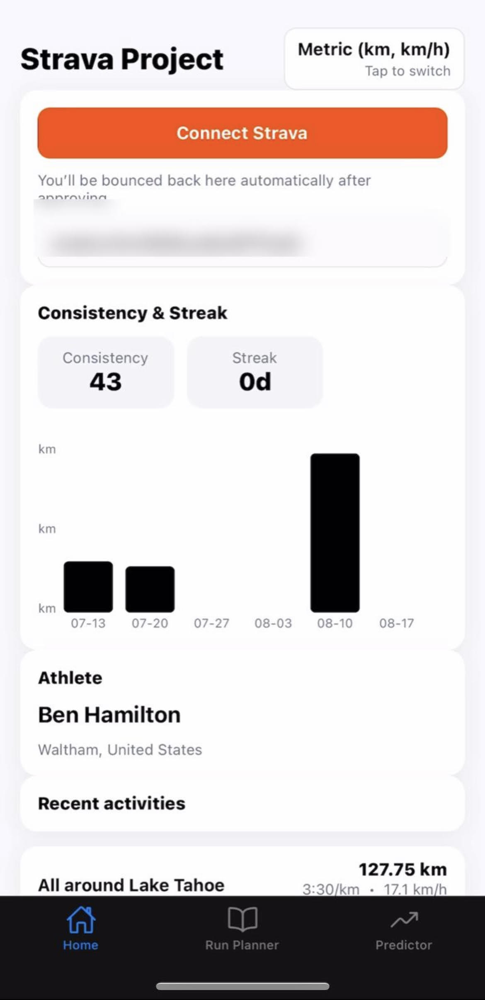
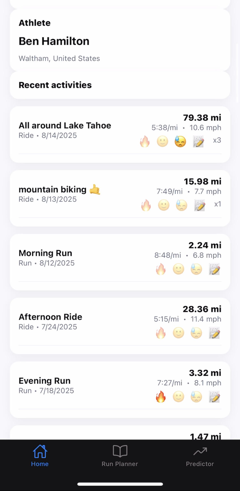
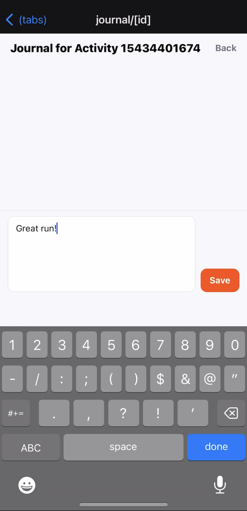
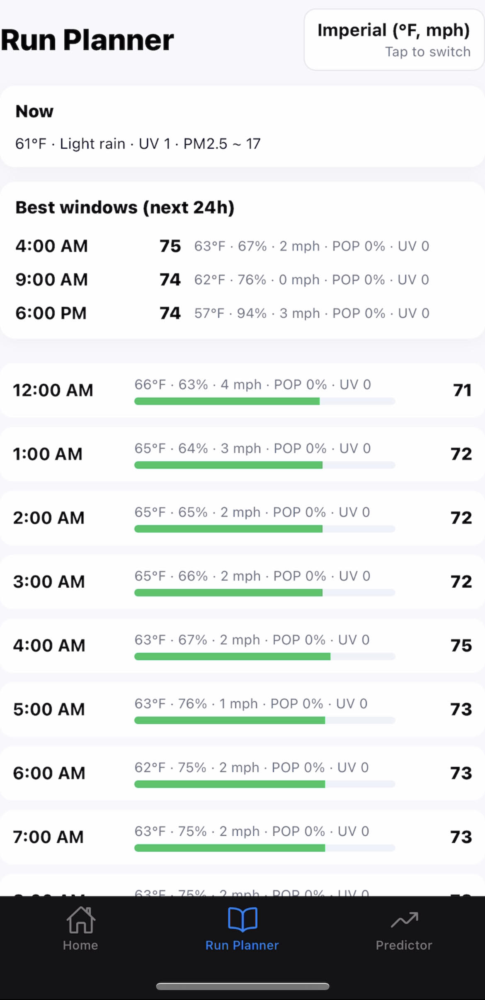
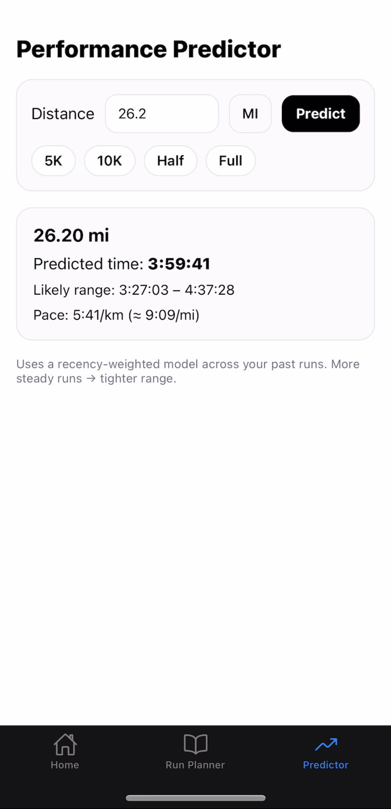

# Strava Project

A React Native app with a Node.js backend for Strava integration, run planning, and performance prediction.

## Features

- **Strava Integration**: Connect your Strava account and view activities
- **Run Planner**: Get weather-based recommendations for optimal running times
- **Performance Predictor**: Predict race times based on your training data
- **Activity Journal**: Add notes and mood tracking to your activities
- **Consistency Tracking**: Monitor your training consistency and streaks

## 📱 Screenshots

| Home | Activities | Journal |
|------|------------|---------|
|  |  |  |

| Run Planner | Performance Predictor |
|-------------|------------------------|
|  |  |


## Setup

### Prerequisites
- Node.js (v18+)
- npm or yarn
- Expo CLI
- Strava API credentials
- Weather API key (optional, for run planner)

### Backend Setup

1. Navigate to the server directory:
```bash
cd server
```

2. Install dependencies:
```bash
npm install
```

3. Copy the example environment file:
```bash
cp env.example .env
```

4. Fill in your environment variables in `.env`:
```bash
# Strava API credentials (get from https://www.strava.com/settings/api)
STRAVA_CLIENT_ID=your_client_id
STRAVA_CLIENT_SECRET=your_client_secret
STRAVA_REDIRECT_URI=http://localhost:4000/auth/strava/callback

# Weather API key (optional, get from https://www.weatherapi.com/)
WEATHER_API_KEY=your_weather_api_key

# Database configuration
DATABASE_URL="file:./prisma/dev.db"

# Server configuration
PORT=4000
```

5. Initialize the database:
```bash
npm run migrate
```

6. Start the server:
```bash
npm run dev
```

The server will be available at `http://localhost:4000`

### Frontend Setup

1. Navigate to the app directory:
```bash
cd app
```

2. Install dependencies:
```bash
npm install
```

3. Copy the example environment file:
```bash
cp env.example .env
```

4. Configure the server URL in `.env`:
```bash
# For emulator/simulator (localhost works):
API_BASE_URL=http://localhost:4000
EXPO_PUBLIC_SERVER_URL=http://localhost:4000

# For physical device on same LAN (REQUIRED):
# Find your computer's IP with: ipconfig (Windows) or ifconfig (Mac/Linux)
# Replace 192.168.1.100 with your actual IP address
API_BASE_URL=http://192.168.1.100:4000
EXPO_PUBLIC_SERVER_URL=http://192.168.1.100:4000
```

5. Start the Expo development server:
```bash
npm start
```

## Security Notes

- Never commit `.env` files or database files
- The `.gitignore` is configured to exclude sensitive files
- Use environment variables for all API keys and secrets
- For production, use proper hosting services and secure database connections

## Development

### Database
- Uses SQLite for local development
- Database file: `server/prisma/dev.db` (automatically ignored by git)
- Run migrations: `npm run migrate` in server directory
- View data: `npm run studio` in server directory

### API Endpoints
- `GET /health` - Health check
- `GET /auth/strava/start` - Start Strava OAuth
- `GET /auth/strava/callback` - OAuth callback
- `GET /me/:userId` - Get athlete profile
- `GET /activities/:userId` - Get activities
- `GET /weather` - Get weather data
- `GET /api/predict` - Performance prediction

## Deployment

### Backend
- Deploy to services like Railway, Render, or Heroku
- Set environment variables in your hosting platform
- Use a production database (PostgreSQL recommended)

### Frontend
- Build with Expo: `expo build`
- Deploy to app stores or use Expo Application Services
- Set production API URLs in environment variables

## Troubleshooting

- **Database issues**: Run `npm run migrate` to reset migrations
- **API errors**: Check your Strava API credentials and redirect URI
- **Weather not working**: Ensure you have a valid Weather API key
- **Device connection**: Use your computer's LAN IP for physical devices
- **Network timeout**: Check if your server is running and accessible from your device
- **Physical device not loading data**: Make sure you've set the correct IP address in your `.env` file

## Contributing

This is an open source project. Feel free to submit issues and pull requests!

## License

MIT License - feel free to use this project for personal or commercial purposes.
